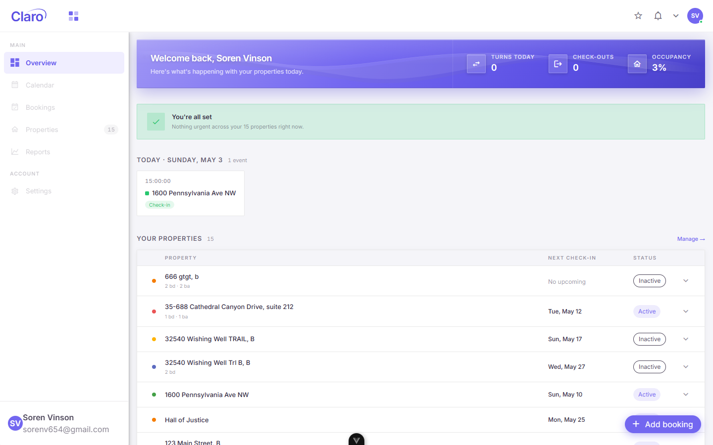

# Claro4

**Multi-tenant scheduling platform for property cleaning businesses.**

Property owners book turnovers, admins assign cleaners, and same-day "turns" get flagged and prioritized automatically. Built as a single Vue 3 application serving three different user roles from one codebase.

**[Live demo → claro4.vercel.app](https://claro4.vercel.app)**



---

## Why this exists

Small property-cleaning operations run on group texts and spreadsheets. The hard part isn't storing bookings — it's that a same-day turnover between two guests has a hard deadline, while a routine clean doesn't, and the two need to be visible and schedulable in completely different ways.

Claro4 models that difference directly. Turns are a first-class concept with their own priority rules, not a flag on a generic appointment.

---

## Roles

The app is built for three user types, though only two have a working interface today:

| Role | Scope | Interface |
|---|---|---|
| **Property Owner** | Their own properties and bookings | Mobile-first, personal calendar, turn alerts |
| **Business Admin** | All clients, all bookings | Master calendar, cleaner assignment, cross-client view |
| **Cleaner** | Assigned jobs only (planned) | Not built yet — cleaners are redirected to a coming-soon page on login |

Role separation runs all the way down for the two built roles — components, composables, and routes are split by owner/admin, and the app is chunked by role at build time for caching. Cleaner assignment and scheduling already exist in the data model and in the admin UI (admins assign cleaners to jobs), but cleaners don't yet have their own interface to view those assignments.

---

## Stack

**Frontend** — Vue 3 (Composition API), TypeScript, Vite
**UI** — Vuetify 4, FullCalendar
**State** — Pinia, Map-based collections
**Backend** — Supabase (Postgres, auth, row-level security)
**Testing** — Vitest, Vue Test Utils, Playwright
**Quality** — ESLint, Prettier, Lighthouse CI
**Deploy** — Vercel

---

## Architecture

```
src/
├── components/
│   ├── dumb/          # Presentational — owner / admin / shared
│   └── smart/         # Orchestration — owner / admin / shared
├── composables/       # Business logic, scoped by role
├── pages/             # Route-level views
└── stores/            # Pinia state
```

Two patterns carry most of the weight:

**Dumb/smart separation.** Presentational components take props and emit events; smart components own data fetching and state. Makes the role-specific UIs cheap to build, since they compose the same dumb components differently.

**Role-based code splitting.** Vite chunks by role at build time (`owner-app`/`admin-app`/`app-core`) for better browser caching. The `build:owner-only` and `build:admin-only` scripts exist but don't yet produce role-exclusive bundles — every build currently ships both roles' code.

---

## Running locally

```bash
git clone https://github.com/Sorenv6543/claro4.git
cd claro4

pnpm install
cp .env.example .env.local  # add your Supabase project URL and anon key
pnpm run dev
```

Requires Node 18+ and pnpm.

### Scripts

```bash
pnpm run dev                # dev server with HMR
pnpm run build:production   # full multi-tenant build
pnpm run build:owner-only   # owner bundle only
pnpm run build:admin-only   # admin bundle only

pnpm run test               # unit tests
pnpm run test:coverage      # with coverage
pnpm run lint               # ESLint
pnpm run preview            # preview production build
```

---

## Status

Actively developed. The core is working and deployed.

**Built and working**
- Role-based architecture and routing across owner and admin interfaces
- Booking and property CRUD
- Calendar views with FullCalendar integration
- Turn detection and priority handling
- Role-based code chunking for caching
- TypeScript strict mode (vue-tsc runs as part of `pnpm run build`; a few pre-existing type errors are still being cleaned up)
- Supabase row-level security policies across bookings, properties, cleaner teams, and user profiles

**In progress**
- Test coverage expansion
- Onboarding flows for new accounts

**Not built yet**
- Cleaner-facing interface (cleaners currently redirect to a coming-soon page after login)
- Marketing/landing page
- Additional booking types beyond standard and turn
- Production analytics

---

## Docs

Vuetify integration patterns and multi-tenant architecture notes live in [`docs/references/`](./docs/references). Day-to-day development conventions live in [`CLAUDE.md`](./CLAUDE.md).

---

*Built by [Soren Vinson](https://github.com/Sorenv6543).*
