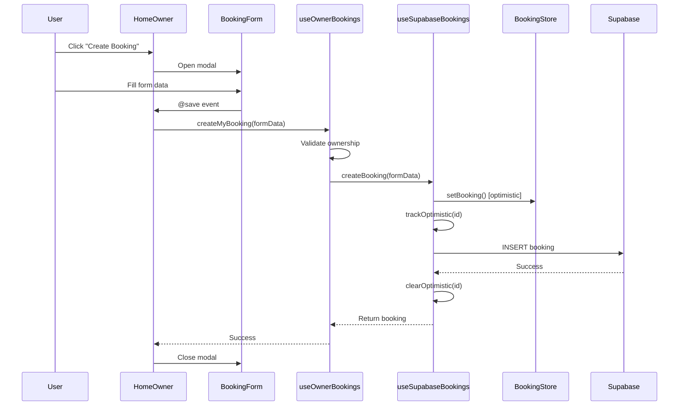

# Codebase Evolution Delta

## Old Snapshot vs Current State

> Compared against: `docs/function-call-flow-analysis.md` (labeled "Production-ready v1.0")
> Current state as of: 2026-03-25

---

## 1. Data Layer Architecture (Major Refactoring)

The single biggest change. The old architecture had stores owning Supabase calls directly. The current architecture introduces a dedicated Supabase composable layer, making stores pure reactive containers.

### Before (v1.0)

```
Component -> Role Composable -> Store -> Supabase
                                 |
                          (CRUD + API + state)
```

```typescript
// Old: Store owned Supabase interaction
export const useBookingStore = defineStore('booking', () => {
  async function addBooking(booking) {
    bookings.value.set(booking.id, booking)       // optimistic
    await supabase.from('bookings').insert(booking) // API call in store
    invalidateCache()
  }
})
```

### After (Current)

```
Component -> Role Composable -> Supabase Composable -> Supabase API
                 |                    |
              (filtering)      (CRUD + realtime + optimistic)
                 |                    |
               Store <------- Store (pure state)
```

```typescript
// Current: Store is pure reactive state -- no Supabase
export const useBookingStore = defineStore('booking', () => {
  // State only
  const bookings = ref<BookingMap>(new Map())

  // Synchronous mutations only
  function setBooking(id: string, booking: Booking) {
    bookings.value.set(id, booking)
    invalidateCache()
  }

  // No async, no Supabase, no CRUD
})
```

```typescript
// Current: Supabase composable owns CRUD + optimistic updates
export function useSupabaseBookings() {
  const bookingStore = useBookingStore()

  async function createBooking(formData: BookingFormData): Promise<Booking> {
    bookingStore.setBooking(id, booking)    // optimistic update via store
    trackOptimistic(id)                     // prevent realtime echo

    try {
      await supabase.from('bookings').insert(booking)  // API call
      return booking
    } catch (error) {
      bookingStore.removeBooking(id)                   // rollback via store
      throw error
    } finally {
      clearOptimistic(id)
    }
  }
}
```

```typescript
// Current: Role composable delegates to Supabase composable
export function useOwnerBookings() {
  const { createBooking: supaCreateBooking } = useSupabaseBookings()

  async function createMyBooking(formData) {
    // 1. Validate ownership
    if (property.owner_id !== currentUserId.value) throw ...
    // 2. Set owner_id
    formData.owner_id = currentUserId.value
    // 3. Delegate
    return await supaCreateBooking(formData)
  }
}
```

### Updated Flow Diagram: Owner Booking Creation



---

## 2. Realtime Sync Rewrite

### Before

Direct channel subscriptions lived inside stores. Each store managed its own Supabase channel.

```typescript
// Old: In-store subscription
supabase.channel('bookings').on('INSERT', (payload) => {
  bookings.value.set(payload.new.id, payload.new)
  invalidateCache()
})
```

### After

A 3-piece architecture:

| Layer | File | Responsibility |
|-------|------|---------------|
| Orchestrator | `useRealtimeSync.ts` | Coordinates init/teardown of bookings + properties + profile subscriptions; handles online/offline reconnection |
| Booking sync | `useSupabaseBookings.ts` | Module-level singleton channel; fetch + subscribe; optimistic ID tracking |
| Property sync | `useSupabaseProperties.ts` | Same pattern as bookings |

```typescript
// Current: useRealtimeSync orchestrates both
async function init() {
  const results = await Promise.allSettled([initBookings(), initProperties()])
  // Partial failure handling -- one source failing does not block the other
  subscribeToProfileChanges()
}
```

Key changes:
- **Module-level singleton channels** -- only one subscription per table, regardless of how many components call the composable
- **Optimistic ID tracking** -- `Set<string>` prevents realtime echo from overwriting in-flight mutations
- **30s safety timeout** -- clears tracking if primary cleanup fails
- **Online/offline listeners** -- automatic reconnection on network recovery
- **Init at layout level** -- `useRealtimeSync().init()` called in `owner.vue` and `admin.vue` layouts, not per-component

---

## 3. Removed Code

| Removed | What it was | Why |
|---------|-------------|-----|
| `ownerData` store | Separate store for owner-specific data | Replaced by owner composables + shared stores |
| `adminData` store | Separate store for admin-specific data | Same -- admin composables + shared stores |
| `backgroundSync` composable | Background data synchronization | Replaced by realtime subscriptions |
| Shared composables (several) | Cross-cutting data composables | Consolidated into role-specific composables |
| `/cleaner/schedule` route | Cleaner role routing | Cleaner UI not yet implemented; route was a dead end |
| `useAuth().login(credentials)` pattern | Auth composable with object credentials | Replaced by `useAuthStore().login(email, password)` |
| `userStore.setUser()` in login flow | Separate user store update during auth | Auth store now delegates entirely to `useSupabaseAuth` |
| `userStore.clearUserPreferences()` in login | Preference clearing on login | Handled by `clearAllRoleSpecificState()` on logout instead |

---

## 4. New Supabase Composable Layer

Entirely new layer that did not exist in v1.0:

| Composable | Exports | Purpose |
|------------|---------|---------|
| `useSupabaseBookings` | `fetchAndSubscribe`, `unsubscribe`, `createBooking`, `updateBooking`, `deleteBooking`, `changeBookingStatus`, `assignCleaner`, `connectionStatus` | All booking I/O + realtime |
| `useSupabaseProperties` | `fetchAndSubscribe`, `unsubscribe`, `createProperty`, `updateProperty`, `deleteProperty`, `connectionStatus` | All property I/O + realtime |
| `useSupabaseAuth` | `user`, `session`, `signIn`, `signUp`, `signOut`, `updateProfile`, `resetPassword`, `checkAuth`, `getAllUsers`, `updateUserRole` | Auth lifecycle + profile loading |
| `useRealtimeSync` | `init`, `teardown`, `connectionStatus`, `isOnline` | Orchestrates the above two |

### Role Composable Delegation Pattern

Role composables no longer contain any Supabase logic. They:
1. Destructure CRUD from the Supabase composable
2. Add ownership validation (owner) or no-filter access (admin)
3. Provide role-specific computed properties
4. Return role-scoped interfaces

```typescript
// Owner: validates ownership before delegating
const { createBooking: supaCreateBooking } = useSupabaseBookings()
async function createMyBooking(formData) { /* validate then delegate */ }

// Admin: no ownership check, direct delegation
const { createBooking: supaCreateBooking } = useSupabaseBookings()
async function createBooking(formData) { return supaCreateBooking(formData) }
```

---

## 5. New Features (Not in v1.0)

### UI Store (`src/stores/ui.ts`)
Centralized UI state management using Maps:
- **Modals**: `Map`-based tracking with `openModal()`, `closeModal()`, `closeAllModals()`
- **Confirm dialogs**: Separate Map with resolve/reject patterns
- **Notifications**: Array-based with auto-dismiss
- **Filters**: `Map<string, FilterValue>` for calendar/list filtering
- **Loading**: `Map<string, boolean>` for granular loading states

### PWA Support
- `usePWA` -- offline detection, install prompt
- `usePushNotifications` -- push notification registration
- `PWANotifications.vue`, `PWAStatusCard.vue` -- UI components

### Mobile / Responsive
- `useSwipeNavigation` -- mobile swipe gesture navigation
- `useResponsiveLayout` -- breakpoint detection
- `mobileViewport.ts` -- viewport utilities
- `MobileBottomNav.vue`, `OwnerBottomNav.vue` -- mobile nav components
- CSS custom property `--app-bar-height` for responsive layout offsets

### Cached Map Filter Utility (`src/utils/cachedMapFilter.ts`)
Reusable TTL-based caching for filtered Map computeds:
```typescript
const cache = createMapCache(10_000) // 10s TTL
const activePropertiesMap = cache.cachedFilter<Property>(
  () => properties.value,
  property => property.active,
)
```
Replaces ad-hoc caching that was scattered across stores.

### Type Helpers (`src/utils/typeHelpers.ts`)
Safe accessors for dealing with Supabase row / app type gaps:
```typescript
const checkoutDate = safeDate(booking.checkout_date)
const field = safeString(unknownValue, 'fallback')
```

### Performance Regression Tests
`performance-regression.spec.ts` -- enforces baselines for subscription counts, cache hit rates, and operation timing. Run via `pnpm test:performance`.

### Role-Specific Builds
```bash
pnpm build:owner-only   # Only includes owner features
pnpm build:admin-only   # Only includes admin features
```
Controlled by build flags: `__ENABLE_OWNER_FEATURES__`, `__ENABLE_ADMIN_FEATURES__`

### Build Chunk Strategy
Explicit chunk splitting in `vite.config.ts`:
`vue-core`, `vuetify`, `calendar`, `supabase`, `vendor`, `app-core`, `owner-app`, `admin-app`

---

## 6. Error Handling Evolution

### Before

Ad-hoc error handling described in the old doc:

```typescript
// Old: Scattered error functions
handleError(err)
rollbackOptimisticUpdate()
formatErrorMessage(err)
showErrorNotification(error)
logError(err)
```

### After

Centralized + role-specific:

| File | Purpose |
|------|---------|
| `src/utils/errorMessages.ts` (500+ lines) | Centralized message catalog by category (auth, booking, property, validation, network) |
| `useOwnerErrorHandler.ts` | Owner-specific error context |
| `useAdminErrorHandler.ts` | Admin-specific error context |
| `useErrorHandler.ts` (shared) | Generic error handling |

Optimistic rollback now lives in the Supabase composable layer (not stores), with structured try/catch/finally:

```typescript
// Current: rollback is co-located with the mutation
try {
  await supabase.from('bookings').update(updates).eq('id', id)
} catch (error) {
  bookingStore.setBooking(id, existing)  // rollback
  throw error
} finally {
  clearOptimistic(id)  // always clean up tracking
}
```

---

## 7. Auth Flow Changes

### Before

```
LoginForm -> useAuth().login(credentials) -> Supabase
          -> AuthStore.setUser(user)
          -> UserStore.setUser(user)
          -> UserStore.clearUserPreferences()
          -> router.push('/owner/dashboard')
```

### After

```
LoginForm -> useAuthStore().login(email, password)
          -> useSupabaseAuth().signIn(email, password)
          -> Supabase auth listener fires
          -> useSupabaseAuth loads profile from user_profiles (3s timeout + fallback)
          -> Auth store computeds update reactively
          -> Router guard reads authStore.isAuthenticated, redirects via getDefaultRouteForRole()
```

Key differences:
- **No separate UserStore update** -- auth store delegates entirely to `useSupabaseAuth`
- **Auth listener pattern** -- `supabase.auth.onAuthStateChange()` drives state, not imperative `setUser()` calls
- **`authChecked` flag** -- one-time per session, reset on logout, prevents redundant auth checks
- **Login page at `/`** -- not `/auth/login` (old doc showed `/auth/login` as possible)
- **Profile loading race condition** -- 3s timeout with fallback profile creation

---

## 8. Store API Surface Changes

### Booking Store

| Old API | Current API | Change |
|---------|------------|--------|
| `addBooking(booking)` | `setBooking(id, booking)` | Renamed, takes explicit ID |
| `updateBooking(id, data)` | `setBooking(id, booking)` | Simplified -- no partial updates in store |
| `deleteBooking(id)` | `removeBooking(id)` | Renamed |
| `invalidateCache()` | `invalidateCache()` | Same |
| `supabase.from(...).insert(...)` | *(removed from store)* | Moved to `useSupabaseBookings` |
| *(n/a)* | `setBookings(data[])` | Bulk set from fetch |
| *(n/a)* | `clearAll()` | Clear on teardown |
| *(n/a)* | `bookingsByStatusMap` | Cached Map grouping |
| *(n/a)* | `bookingsByTypeMap` | Cached Map grouping |
| *(n/a)* | `bookingsByProperty(id)` | Parameterized cached filter |
| *(n/a)* | `bookingsByOwner(id)` | Parameterized cached filter |

### Property Store

Same pattern -- went from CRUD + Supabase to pure reactive state with `setProperties`, `setProperty`, `removeProperty`, `clearAll`. New cached Map getters: `activePropertiesMap`, `propertiesByPricingTierMap`, `propertiesByOwner`.

---

## 9. Component Growth

### Old (v1.0 implied)

The old doc referenced a handful of components:
- `HomeOwner.vue`, `HomeAdmin.vue`
- `BookingForm.vue`, `CleanerModal.vue`
- `FullCalendar.vue`
- Generic modal management in parent components

### Current Totals

| Category | Count | Notable Additions |
|----------|-------|-------------------|
| Smart/Owner | 11 | `OwnerPropertyCreate`, `OwnerPropertyEdit`, `OwnerPropertyView`, `OwnerBottomNav`, `OwnerNavigationDrawer` |
| Smart/Admin | 11 | `AdminDashboard`, `AdminCleaners`, `AdminPropertyOwners`, `AdminOwnerDetail`, `AdminUsers`, `AdminReports`, `AdminSidebar` |
| Smart/Shared | 1 | `FullCalendar.vue` |
| Dumb/Owner | 13 | `PropertyColorPicker`, `PropertySectionCard`, `PropertyAccessSection`, `PropertyInfoSection`, `PropertyContactSection`, `PropertyCleaningSection`, `PropertyPhotosSection` |
| Dumb/Admin | 13 | `BookingDetailsModal`, `BulkRoleChangeDialog`, `CleanerAssignmentModal`, `PerformanceMetricsDashboard`, `TurnPriorityPanel`, `UserFormDialog`, `OwnerDetailCard` |
| Dumb/Shared | 20 | `DatePickerField`, `TimePickerField`, `DatePickerModal`, `PropertyModal`, `TurnPriorityBadge`, `UrgentTurnIndicator`, `UpcomingCleanings`, `QuickActionsFab`, PWA components |
| **Total** | **69** | |

### Calendar Integration

| Old | Current |
|-----|---------|
| `transformBookingsToEvents()` | `bookingToCalendarEvent(booking, property?)` in `calendarHelpers.ts` |
| Direct calendar manipulation in components | Shared `FullCalendar.vue` smart component |
| *(n/a)* | `mergeCalendarEvents(events, strategy)` for multi-source merging |
| *(n/a)* | `OwnerCalendarControls.vue`, `AdminCalendarControls.vue` dumb components |
| *(n/a)* | `useOwnerCalendarState`, `useAdminCalendarState`, `useCalendarState` composables |

---

## 10. Summary of Architectural Direction

The codebase moved from a **store-centric** architecture (stores as fat orchestrators containing state + API + CRUD + subscriptions) to a **layered composable** architecture:

```
+---------------------------------------------+
|  Components (smart + dumb)                  |
+---------------------------------------------+
|  Role Composables (owner/admin)             |
|  - Ownership validation                     |
|  - Role-scoped computed properties          |
|  - Delegate CRUD to Supabase composables    |
+---------------------------------------------+
|  Supabase Composables                       |
|  - CRUD operations                          |
|  - Realtime subscriptions                   |
|  - Optimistic updates + rollback            |
|  - Connection status tracking               |
+---------------------------------------------+
|  Stores (pure reactive state)               |
|  - Map<string, T> collections               |
|  - Cached filtered Maps (10s TTL)           |
|  - Synchronous mutations only               |
|  - No I/O, no async                         |
+---------------------------------------------+
|  Utils (pure functions)                     |
|  - Business logic                           |
|  - Type helpers                             |
|  - Error messages                           |
|  - Calendar conversion                      |
+---------------------------------------------+
```

This separation enables: independent testing of each layer, role-specific builds that tree-shake unused code, and realtime sync that does not compete with user-initiated mutations.

---

*Generated from codebase comparison analysis*
*Compared: function-call-flow-analysis.md (v1.0) vs current state (2026-03-25)*